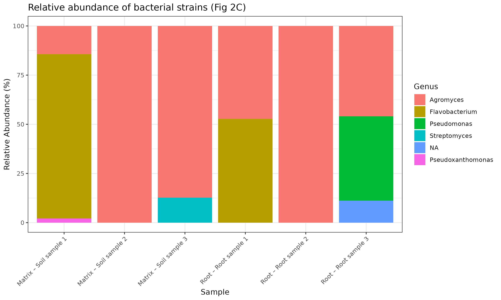

---

## Pipeline Description

### Step 1 – Data and Reference Download  
**Script:** `01_download_data.sh`

- Downloads the GEO reference genome for dataset **GSE231841**
- Downloads raw RNA-seq reads from SRA using `fasterq-dump`
- Retrieves bacterial coding sequences (CDS) from **AT-SPHERE**
- Decompresses and concatenates all bacterial CDS into a single reference file

**Output:**  
Raw FASTQ files and bacterial CDS reference (`allCDS_bacteria.ffn`)

---

### Step 2 – Read Trimming and Quality Control  
**Script:** `02_trim_reads_fastp.sh`

- Adapter trimming and quality filtering using **fastp**
- Removal of low-quality bases and short reads
- Generation of quality control reports

**Output:**  
Quality-filtered FASTQ files

---

### Step 3 – Host Read Removal  
**Script:** `03_filter_host_bowtie2.sh`

- Alignment of reads to the plant host genome using **Bowtie2**
- Removal of host-derived reads
- Retention of non-host (microbial) reads

**Output:**  
Host-filtered FASTQ files

---

### Step 4 – Bacterial Gene Expression Quantification  
**Script:** `04_salmon_bacteria.sh`

- Construction of a Salmon index using bacterial CDS
- Transcript-level quantification of gene expression
- TPM-based abundance estimates

**Output:**  
Salmon quantification directories per sample

---

### Step 4.5 – Gene-to-Species Mapping  
**Script:** `04.5_build_gene_to_species.py`

- Mapping of bacterial genes to their corresponding species
- Generation of a gene-to-species lookup table

**Output:**  
Gene-to-species mapping file

---

### Step 5 – TPM Matrix Construction  
**Script:** `05_build_tpm_matrix.py`

- Extraction of TPM values from Salmon outputs
- Merging of all samples into a unified TPM matrix
- Preparation of expression data for downstream analysis

**Output:**  
TPM expression matrix (genes × samples)

---

### Step 6 – Relative Abundance Calculation  
**Script:** `06_relative_abundance_bacteria.py`

- Aggregation of gene-level TPM values by species
- Normalization to relative abundance
- Separation of samples by experimental condition (root vs matrix)

**Output:**  
Species-level relative abundance table

---

## Figures and Interpretation

### Figure 2A – Venn Diagram of Bacterial Species

This figure illustrates the overlap of bacterial species detected across experimental conditions (root vs matrix). Species presence/absence was determined from the species-level relative abundance table.


---

### Figure 2C – Relative Abundance of Bacterial Species

This figure displays the relative abundance of bacterial species across samples, separated by experimental condition. Abundance values were calculated from TPM-normalized gene expression aggregated at the species level.



---

## Low Mapping Rate Explanation

The overall mapping rate observed in this analysis is lower than that reported in the reference study. Consequently, the final figures display a reduced number of bacterial genera and species compared to the original publication.

Several factors may contribute to this discrepancy:

1. **Reference Genome Differences**  
   The bacterial CDS reference used in this pipeline was constructed from publicly available genomes retrieved from AT-SPHERE. Differences between this reference and the curated genome set used in the original study may reduce mapping efficiency.

2. **Strain-Level Genetic Divergence**  
   RNA-seq reads originating from strains that are genetically divergent from the available reference genomes may fail to align or be assigned during quantification.

3. **Stringent Host-Filtering Steps**  
   Aggressive removal of host-derived reads during the Bowtie2 filtering step may inadvertently discard microbial reads with partial similarity to the host genome.

4. **Quantification Parameter Differences**  
   Variations in Salmon indexing strategies and alignment parameters relative to the original pipeline may further impact mapping rates.

Despite the low mapping rate, the detected bacterial taxa and relative abundance patterns remain biologically interpretable and demonstrate the logical consistency of the pipeline. These results highlight the sensitivity of metatranscriptomic analyses to reference completeness and parameter selection.

---

## Notes to Self

1. **CDS Download Reliability and Reference Completeness**  
   The bacterial coding sequences (CDS) used in this pipeline were downloaded from the AT-SPHERE database. This resource appears to be partially outdated and may suffer from limited accessibility or incomplete genome coverage. Download interruptions, missing files, or unavailable genomes could directly affect reference completeness and downstream mapping performance. In future iterations, references should be validated for completeness or complemented with alternative databases.

2. **Impact of Outdated or Incomplete Genomic Resources**  
   Because some genomes may be missing or poorly annotated in the AT-SPHERE database, reads originating from absent or divergent bacterial strains may fail to map. This likely contributes to the observed low mapping rate and reduced taxonomic diversity in the final results.

3. **Sensitivity of Mapping Rate to Reference Quality**  
   The low overall mapping rate observed in this analysis is likely driven by limitations in the available bacterial reference rather than issues with the pipeline logic itself. Improving reference genome quality, incorporating additional strain-level genomes, or using genome-resolved metagenomic assemblies may substantially increase mapping efficiency in future analyses.

---

## Requirements

### Software
- Bash
- Python ≥ 3.8
- R ≥ 4.2
- fastp
- Bowtie2
- Salmon
- SRA Toolkit

### R Packages
- tidyverse  
- VennDiagram  
- ggplot2  

---

## Usage

Scripts should be executed **sequentially**, following their numbering:

```bash
sbatch 01_download_data.sh
sbatch 02_trim_reads_fastp.sh
sbatch 03_filter_host_bowtie2.sh
sbatch 04_salmon_bacteria.sh
python 04.5_build_gene_to_species.py
python 05_build_tpm_matrix.py
python 06_relative_abundance_bacteria.py
Rscript 07_fig2A_venn.R
Rscript 08_fig2C_relative_abundance.R
